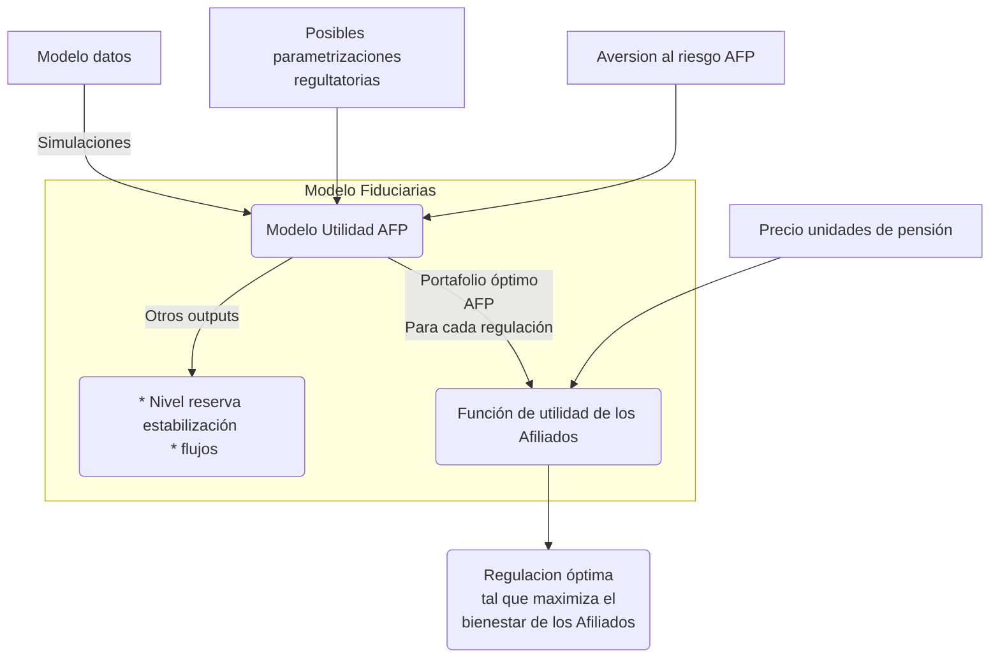
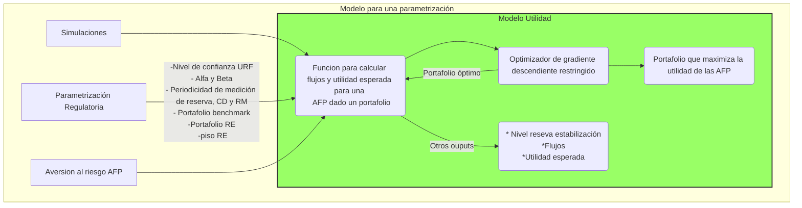

# URF_AFP

Repositorio con la modelación de la reacción de las fiduciarias ante una parametrización regulatoria.

## Estructura del repositorio

### Requerimientos

Para correr los códigos se requiere una instalación de R igual o superior a 4.1

### Estructura de carpetas

A continuación se muestra la estructura de carpetas.

```text
📦URF_AFP
 ┣ 📂data
 ┃ ┣ 📂 exceles 
 ┃ ┃ ┗ 📜datosActuales.xlsx
 ┃ ┣ 📂procesado
 ┃ ┃ ┣ 📜afiliadosCesantias.xlsx
 ┃ ┃ ┣ 📜afiliadosObligatorias.xlsx
 ┃ ┃ ┗ 📜afiliadosVoluntarias.xlsx
 ┣ 📂codigo
 ┃ ┣ 📂extraccion
 ┃ ┃ ┣ 📜README.md
 ┃ ┃ ┣ 📜manipulacion.R
 ┃ ┃ ┣ 📜scrappingPUC.ipynb
 ┃ ┃ ┗ 📜unirPUC.r
 ┃ ┣ 📂modelo
 ┃ ┃ ┣ 📜funcionesAux.r
 ┃ ┃ ┣ 📜funcionesParametros.r
 ┃ ┃ ┣ 📜funcionesUtilidadEsperada.r
 ┃ ┃ ┣ 📜optimizacionGeneral.r
 ┃ ┃ ┣ 📜optimizacionGradienteFuncional.r
 ┃ ┃ ┗ 📜presentacion.R
 ┃ ┣ 📂procesamientoData
 ┃ ┃ ┗ 📜cargaDatos.r
 ┣ 📜.gitignore
 ┣ 📜ExplicacionGastos.md
 ┗ 📜README.md
 ```

En las carpeta modelo se encuentran las funciones que componen el modelo. En particular en el archivo `presenacion.R` se encuentra la implementación que llevó a las recomendaciones presentadas en el documento. Los demás archivos que se encuentran en esa carpeta contienen funciones auxiliares para realizar la optimización.

En la carpeta `procesamientoData` se encuentra el script que se requiere para organizar los datos provenientes de **ACA FALTA DEFINIR COMO VA A SER LA TRANSMISIÓN DE INFORMACIÓN CON LOS MODELOS DE JD**.

Por último, la carpeta `extraccion` contiene scripts del submodelo de gastos e ingresos de las AFP. Este está mejor descrito en: [README.md](./codigo/extraccion/README.md) que es específico a esta carpeta.

En data se encuentran los insumos y resultados del submodelo de gastos de las AFP. En caso de quere correrlo se requieren actualizar los exceles al interior de procesado, ahí están contenidos los números de afiliados para cada uno de los negocios de las AFP.

Se debe tener en cuenta que se deben crear las siguientes carpetas para que funcione el modelo.

```text
📦URF_AFP
 ┣ 📂imagenes
 ┣ 📂datos
 ┣ 📂data
 ┃ ┣ 📂 binarios
 ┃ ┣ 📂 PUC 
 ┃ ┣ 📂 final 
````

Estas carpetas se llenan con información automáticamente, después de que se corren los scripts de cada uno de los modelos.

### Lógica del modelo

El modelo de las AFP busca, dada una parametrización regulatoria, anticipar cual sería la reacción de las AFP (entendida como el portafolio escogido) ante una regulación específica.

### Diagrama de flujo del modelo



Se realiza zoom en el modelo de utilidad de las AFP para una parametrización regulatoria en particular:



Este modelo se itera sobre todas las posibles regulaciones, al final se encuentra la que maximiza la utilidad (equivalente de certeza) de los Afiliados. Esto permite encontrar la regulación que maximiza el bienestar de los afiliados al RAIS.

#### Inputs del modelo

El modelo cuenta con dos clases de inputs en primer lugar están los que dependen de otros bloques constructores del modelo de regulación desarrollado. Estos son:

- Econometría: histórico de precios de una serie de activos escogidos, además una proyección de la distribución de estos para un periodo definido por el modelador. Adicionalmente se requieren históricos y proyecciones del IPC y de la tasa de cambio USD/COP.

- Portafolio benchmark: Se requiere definir un portafolio que siga el pasivo pensional de los afiliados. Este será utilizado como benchmark para el seguimiento de las AFP.

- Proyección del valor del pasivo pensional para el horizonte de análisis.

En segundo lugar se cuenta con inputs que tienen que ser ingresados manualmente:

- Aversión al riesgo de los entes territoriales.

- Aversión al riesgo de las fiduciarias.

- Nivel de confianza de los entes territoriales (FONPET).

- Piso de la reserva de estabilización.

- Rango plausible de $\alpha$ y $\beta$.

### Outputs

El modelo tiene diversos ouputs posibles dependiendo de la configuración. A continuación se listan algunos de ellos:

- Portafolio que maximiza la utilidad esperada de los afiliados.

- Flujos resultantes para las AFP de un portafolio.

- Nivel de reserva de estabilización que sea consistente con el nivel de confianza deseado y la parametrización regulatoria.

- Utilidad generada para las fiduciarias por un portafolio y una parametrización regulatoria.

